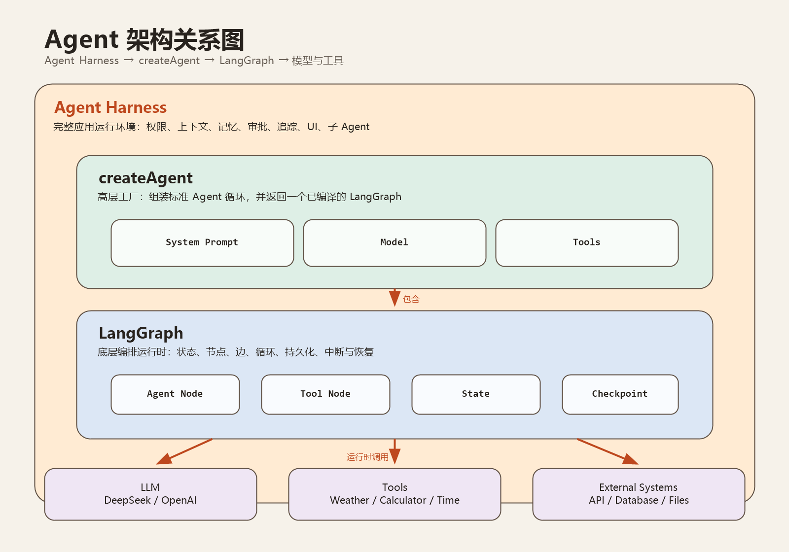

# createAgent、Agent Harness 与 LangGraph



## 一句话理解

`createAgent` 用来快速创建 Agent，`LangGraph` 负责执行和管理 Agent 工作流，`Agent Harness` 则是包围 Agent 的完整应用运行环境。

```text
Agent Harness
└── createAgent 创建的 Agent
    └── LangGraph 编排运行时
        ├── LLM（DeepSeek / OpenAI）
        ├── Tools（Weather / Calculator / Current Time）
        └── 外部系统（API / 数据库 / 文件）
```

## 三者分别负责什么

### createAgent

`createAgent` 是高层 Agent 工厂。开发者传入模型、System Prompt 和工具，它会组装常见的“模型判断 → 调用工具 → 返回结果 → 模型继续回答”循环。

它适合快速搭建标准 Tool Calling Agent。其返回结果不是一个普通函数，而是一个已经编译、可运行的 LangGraph。

### LangGraph

LangGraph 是底层工作流编排和运行时。它使用节点、边和状态描述执行过程，负责循环、条件分支、持久化、暂停恢复和人工审批等能力。

当标准 Agent 循环不够用时，可以直接使用 LangGraph，例如：

- 先搜索资料，再调用多个工具，最后交给审查节点。
- 工具执行前暂停，等待用户批准。
- 保存对话状态，程序重启后继续执行。
- 创建多个 Agent 协作的工作流。

### Agent Harness

Agent Harness 不是某一个固定 API，而是让 Agent 能够安全、稳定地工作的外围系统。它通常包含：

- Prompt 和上下文组装。
- 工具注册、权限控制和调用审批。
- 会话记忆、任务状态和文件访问。
- 日志、Tracing、错误恢复和用量统计。
- 前端对话界面、流式输出和用户交互。
- 子 Agent 管理和任务调度。

## 一次请求如何运行

1. 用户从 Harness 的聊天界面发送问题。
2. Harness 加载角色 Prompt、历史消息、权限和可用工具。
3. `createAgent` 创建的 Agent 把上下文交给模型。
4. 模型决定直接回答，或者生成 Tool Call。
5. LangGraph 将执行流转到 Tool Node。
6. Harness 检查权限并执行真实工具。
7. 工具结果写回 State，LangGraph 再次调用模型。
8. 模型生成最终答案，Harness 将内容流式展示给用户。

## 与当前 ChatDemo 项目的对应关系

当前项目已经手动实现了一个简化版 Agent：

| 当前项目 | Agent 架构中的职责 |
| --- | --- |
| `openaiCompatibleProvider.ts` | 模型调用和 Agent 工具循环 |
| `toolSchemas` | 提供给模型的工具定义 |
| `toolExecutor.ts` | Tool Node 的执行逻辑 |
| Prompt 角色文件 | System Prompt 和角色上下文 |
| React 聊天前端 | Harness 的用户交互层 |
| SSE Streaming | Harness 的流式输出能力 |

如果以后迁移到 LangChain：

- 用 `createAgent` 替换 Provider 中手写的 Tool Calling 循环。
- 用 LangGraph 管理节点、状态、循环、检查点和人工审批。
- 保留并扩展现有前端、Prompt、权限、日志等 Harness 能力。

## 关系总结

```text
createAgent 是便捷入口
LangGraph 是执行引擎
Agent Harness 是完整运行环境
```

三者不是互相替代，而是由外到内、由高层到低层的协作关系。
