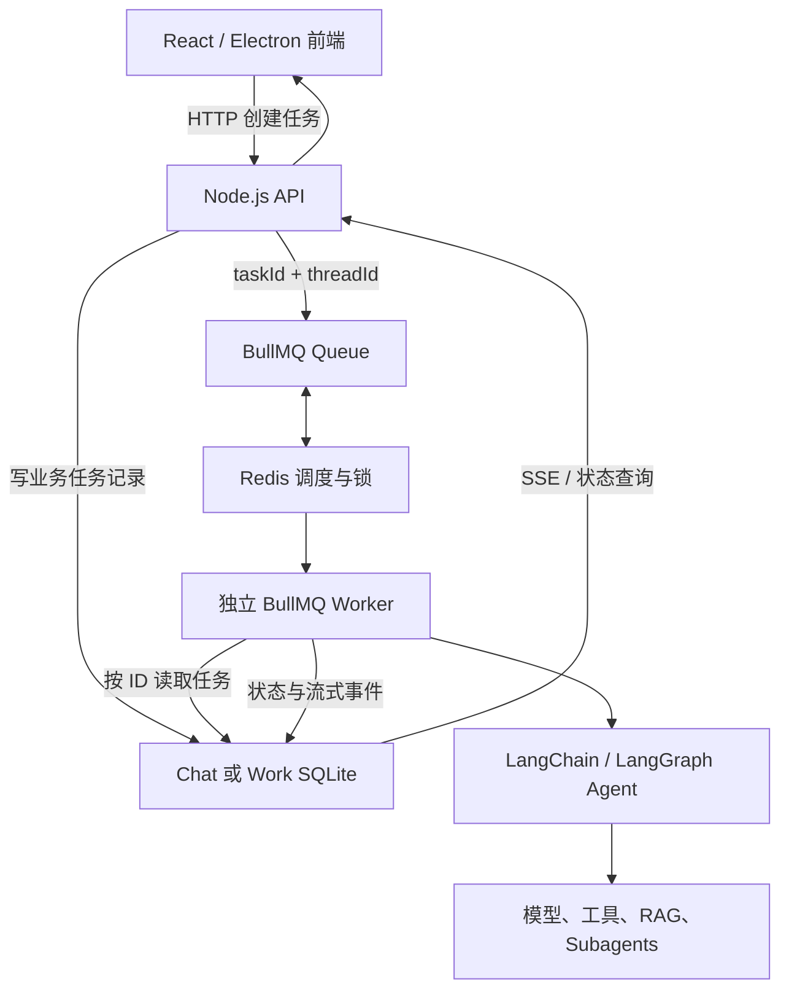

# 异步长任务：BullMQ、Redis、Queue 与 Worker

## 1. 为什么需要异步任务

普通聊天通常可以在一次 HTTP 请求中完成，并通过 SSE 流式返回文字。文档分析、知识库索引、批量处理、运行测试和多 Agent 协作可能持续数分钟；如果始终占用原请求，会遇到刷新丢失、网络断开、无法重试和 API 进程压力过大等问题。

异步任务把“接收请求”和“执行任务”拆开：API 快速创建任务，Worker 在后台执行，用户刷新页面后仍能看到任务状态。

## 2. 核心名词

### Queue（队列）

Queue 是等待执行的任务集合。API 把任务放入队列，不直接执行耗时工作。

### Redis

Redis 是 BullMQ 的调度基础设施，用来保存：

- 等待、执行中、延迟和失败任务的调度状态；
- Worker 锁和并发控制；
- 重试次数、退避时间和任务进度；
- 少量任务标识与路由元数据。

Redis **不保存 Work 对话正文、用户记忆、附件内容或项目文件**。

### BullMQ

BullMQ 是 Node.js 的 Redis 任务队列框架，提供可靠入队、Worker 消费、并发、失败重试、延迟任务和任务生命周期管理。

### Worker

Worker 是独立于 API 的执行进程。它从 BullMQ 获取任务 ID，再从业务存储读取任务内容，调用 LangChain/LangGraph Agent、模型和工具。

### SSE

Server-Sent Events 让前端持续收到增量文本、当前步骤、命令、文件修改和最终状态。SSE 断开不会取消 BullMQ 任务；重新打开对话后可从持久化事件继续展示。

## 3. 当前项目架构



## 4. Chat 与 Work 的数据边界

| 数据 | Chat 模式 | Work 模式 | Redis |
| --- | --- | --- | --- |
| 对话与消息 | 服务端业务库 | 用户电脑本地 SQLite | 不保存 |
| 短期记忆与 Checkpoint | 服务端业务库 | 用户电脑本地 SQLite | 不保存 |
| 上传和生成文件 | 服务端文件存储 | 用户本地目录 | 不保存 |
| Diff、快照和审批记录 | 服务端或业务存储 | 用户本地 SQLite/目录 | 不保存 |
| taskId、队列状态、锁 | 可关联 | 可关联 | 保存 |
| 重试与延迟调度 | BullMQ | BullMQ | 保存 |

因此使用 BullMQ 不会改变“单个 Work 对话记忆留在用户本地”的规则。Redis 只知道需要调度哪个任务，不持有任务正文。

## 5. 一次长任务的执行流程

1. 用户发送可能耗时的请求。
2. API 在对应 Chat/Work SQLite 创建业务任务记录。
3. API 只把 `taskId`、`threadId` 和任务类型加入 BullMQ。
4. 独立 Worker 领取任务并加锁，防止重复消费。
5. Worker 根据任务 ID 从业务库读取模型、角色和消息内容。
6. Worker 执行 Agent，并持续记录进度与流式事件。
7. 前端通过 SSE 展示“正在思考、运行命令、修改文件”等安全操作状态。
8. 成功后任务变为 `completed`；失败时 BullMQ 按指数退避重试，最多 5 次。
9. 用户刷新页面时，前端从业务任务记录恢复卡片，不依赖原 HTTP 请求仍然存在。

## 6. 任务状态

| 状态 | 含义 |
| --- | --- |
| `queued` | 已写入业务库并等待 Worker |
| `running` | Worker 已领取并执行 |
| `retrying` | 本次失败，等待 BullMQ 延迟重试 |
| `completed` | 执行成功 |
| `failed` | 达到最大次数后仍失败 |
| `cancelled` | 用户停止任务 |

任务状态会同时投影到 SQLite，供历史记录和刷新恢复使用；BullMQ/Redis 是调度真相，SQLite 是用户界面和业务审计真相。

## 7. 重试、取消与幂等

### 自动重试

- BullMQ 使用指数退避；默认从 1 秒开始。
- 最大尝试次数为 5，避免无限循环和 Token 浪费。
- 每次尝试次数同步回业务任务记录，前端可以正确显示。

### 用户取消

- 等待或延迟任务会从 BullMQ 移除。
- 已运行任务在本地业务库写入取消标记。
- Worker 轮询取消标记并触发 `AbortSignal`，模型和工具应响应中止信号。

### 幂等要求

BullMQ 保证可靠调度，但不能自动保证业务操作只产生一次副作用。写文件、发消息或写数据库前仍应使用 `taskId + turnId + 操作标识` 做幂等检查。

## 8. 前端展示原则

任务卡片位于对应对话轮次中，不新增左侧任务列表。卡片可以展示：

- 当前步骤和处理时间；
- 运行过的命令；
- 修改的文件和增删行数；
- 停止、重试、查看 Diff 和回退操作。

卡片不能展示模型的隐藏思维链，只展示用户可以理解和验证的操作事件。

## 9. 启动方式

### Electron 桌面模式

```powershell
npm run desktop
```

该命令会依次启动 Redis、构建项目，然后由 Electron 启动 API 和独立 Worker。

### 分开调试

```powershell
npm run services:queue
npm run start
npm run worker
```

三个命令分别运行 Redis、API 和 Worker，适合观察日志。

## 10. 配置项

| 环境变量 | 默认值 | 作用 |
| --- | --- | --- |
| `REDIS_URL` | `redis://127.0.0.1:6379` | Redis 地址 |
| `BULLMQ_WORKER_CONCURRENCY` | `2` | 单 Worker 同时执行任务数 |
| `BULLMQ_RETRY_DELAY_MS` | `1000` | 指数退避基础延迟 |
| `BULLMQ_COMPLETED_RETENTION_SECONDS` | `86400` | Redis 成功任务保留时间 |
| `BULLMQ_FAILED_RETENTION_SECONDS` | `604800` | Redis 失败任务保留时间 |

## 11. 代码位置

| 文件 | 职责 |
| --- | --- |
| `src/tasks/backgroundTaskQueue.ts` | BullMQ Queue 与 Redis 连接 |
| `src/tasks/backgroundTaskWorker.ts` | BullMQ Worker、重试状态和取消信号 |
| `src/tasks/backgroundTaskRepository.ts` | SQLite 业务任务与事件投影 |
| `src/tasks/agentChatTaskHandler.ts` | Agent 长任务执行逻辑 |
| `src/worker.ts` | 独立 Worker 进程入口 |
| `src/server.ts` | 入队、查询、取消、重试和 SSE API |
| `compose.yaml` | Redis、Chroma、Docling 服务 |
| `client/main.tsx` | 对话内任务卡和状态恢复 |

## 12. 前后端分离后的演进

未来 Web 前后端分离时，API、Redis 和云端 Worker 可以部署在服务器；Chat 数据迁移到 PostgreSQL 和对象存储。Electron Work 模式仍应启动本机 Worker，并使用本地 SQLite 与项目目录，从而保持工作记忆和文件不离开用户电脑。

