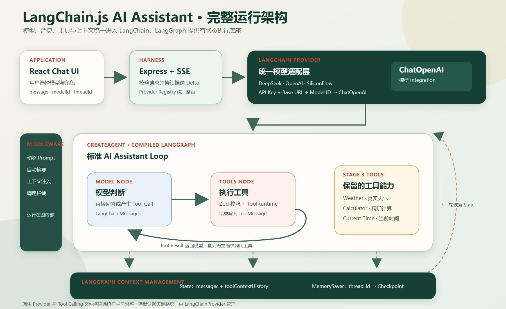

# LangChain.js 版 AI Assistant



## 目标

当前项目把模型、消息、工具和上下文管理统一迁移到 LangChain.js，同时保留第三阶段的三个工具：

- Weather：查询真实天气。
- Calculator：执行确定性四则运算。
- Current Time：查询指定 IANA 时区的当前时间。

## 运行链路

```text
React Chat UI
    ↓ message + modelId + roleId + threadId
Express /api/chat
    ↓
Provider Registry
    ↓
LangChainProvider
    ↓
ChatOpenAI（DeepSeek / OpenAI / SiliconFlow）
    ↓
createAgent
    ├── LangChain Messages
    ├── LangChain Tools
    ├── Dynamic Memory Middleware
    ├── Summarization Middleware
    └── LangGraph MemorySaver
```

## 四部分迁移结果

### 模型

三个 Provider 都由 `LangChainProvider` 创建 `ChatOpenAI`。平台差异只保留在 API Key、Base URL、模型 ID 和 OpenAI 推理强度配置中。

### 消息

Few-shot 示例与用户输入在 Agent 边界转换为 `HumanMessage` 和 `AIMessage`。模型产生的 Tool Call、工具结果和最终回复也使用 LangChain Message 表达。

### 工具

三个工具使用 `tool()`、Zod Schema 和描述注册。`createAgent` 根据模型输出自动选择工具，LangGraph Tools Node 负责执行并返回结果。

### 上下文

`MemorySaver` 按 `thread_id` 保存消息和自定义状态。工具通过 `ToolRuntime` 读取状态，通过 `Command` 写入 `ToolMessage` 与 `toolContextHistory`。

动态 Middleware 在模型调用前读取消息和工具状态，创建只对当前请求生效的 System Prompt。对话接近 8,000 Token 时，摘要 Middleware 会压缩较旧消息并保留最近 12 条。

## 原生第三阶段代码

`src/providers/openaiCompatibleProvider.ts` 和 `src/tools` 下的原生 Schema、Executor 仍然保留，便于对照学习原生 Tool Calling 与 LangChain Agent 的区别。

当前默认运行链路只使用：

- `src/providers/langChainProvider.ts`
- `src/agents/langChainToolAgent.ts`
- `src/agents/toolMemoryState.ts`
- `src/agents/dynamicMemoryPromptMiddleware.ts`
- `src/tools/langchain/*.ts`
