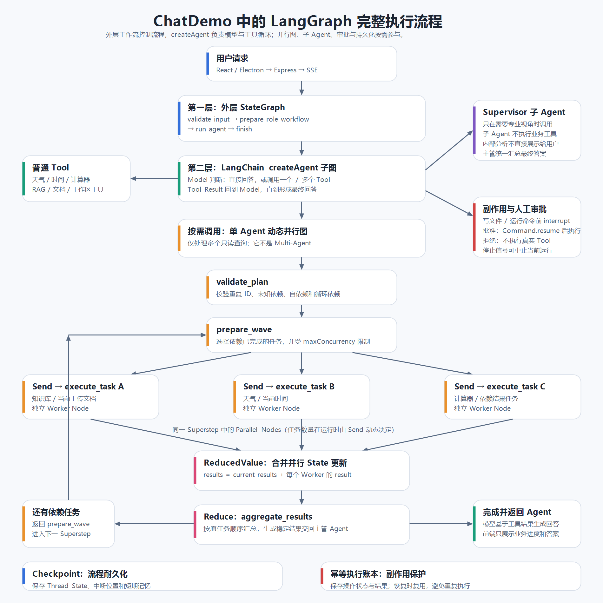

# LangGraph 完整学习笔记



## 1. LangGraph 是什么

LangGraph 是用于构建**长时间运行、有状态、可恢复**的 Workflow 和 Agent 的底层编排框架。它把业务过程描述为图，并提供持久化、流式输出、人工介入、故障恢复和状态调试等运行时能力。

LangGraph 可以独立使用，也可以和 LangChain 一起使用：

```text
LangChain
├── Model、Prompt、Tool、Retriever 等组件
└── createAgent：快速创建标准 Agent

LangGraph
├── State、Node、Edge：定义执行图
├── Checkpointer、Store：保存状态和记忆
└── Streaming、Interrupt、Command：控制执行过程
```

`createAgent()` 底层也是一个 LangGraph 图。复杂项目可以把 `createAgent` 作为一个子图或 Node，嵌入自定义 LangGraph Workflow。

## 2. Workflow 和 Agent 的区别

### Workflow

Workflow 的路径主要由代码预先确定，适合规则明确、需要稳定控制的任务。

例如：

```text
接收文章 → 提取主题 → 生成摘要 → 人工审查 → 发布
```

### Agent

Agent 的路径由模型根据上下文动态决定。模型可以选择工具、重复调用工具，直到满足停止条件。

例如：

```text
用户目标 → Model
             ├─ 直接回答
             └─ 调用 Tool → Tool Result → 再次 Model
```

### 组合使用

实际项目通常组合二者：

- 外层 Workflow 保证输入检查、权限、审批和结束流程。
- 内层 Agent 自主决定工具调用和解决问题的步骤。
- 确定性步骤交给普通代码，不必全部交给 LLM。

## 3. Graph API 三个基础构件

### State

State 是图中所有 Node 共享的数据快照。Node 读取当前 State，并返回局部更新。

适合放入 State 的数据：

- 后续 Node 仍然需要的数据。
- 重新获取成本较高的数据。
- 中断恢复后必须保留的数据。
- 需要调试或审计的执行结果。

不适合放入 State 的数据：

- 可以随时根据已有数据重新计算的内容。
- 已经格式化好的完整 Prompt。
- 无限制增长且不做裁剪的临时数据。

重要原则：

> State 保存原始数据，Prompt 在 Node 执行时按需组装。

多 Node 同时更新同一个字段时，需要 Reducer 决定覆盖、追加或合并方式。

### Node

Node 是接收 State 并返回 State Update 的函数。Node 可以执行：

- 普通 TypeScript 逻辑。
- LLM 调用。
- 数据库或检索操作。
- 外部 API 和 Tool。
- 用户输入与人工审批。
- 一个完整子图或 Agent。

Node 应尽量只负责一个清晰步骤。Node 越清晰，Checkpoint、重试和调试的边界越明确。

### Edge

Edge 决定下一步执行哪个 Node：

- `addEdge`：固定跳转。
- `addConditionalEdges`：根据 State 动态分支。
- `START`：图入口。
- `END`：图结束。
- 循环边：返回之前的 Node。

## 4. 两种开发 API

### Graph API

Graph API 显式定义 State、Node 和 Edge，适合：

- 分支、循环和并行较多。
- 需要精确查看每个执行步骤。
- 需要定制状态合并和子图。
- 复杂 Agent 或生产工作流。

核心结构：

```ts
const graph = new StateGraph(State)
  .addNode("prepare", prepareNode)
  .addNode("execute", executeNode)
  .addEdge(START, "prepare")
  .addConditionalEdges("prepare", routeNext)
  .addEdge("execute", END)
  .compile({ checkpointer });
```

### Functional API

Functional API 使用 EntryPoint 和 Task 组织普通函数，适合：

- 希望保留过程式代码风格。
- 流程相对线性。
- 不想显式维护大量 Node 和 Edge。
- 仍然需要持久化、暂停恢复和流式能力。

Graph API 和 Functional API 共用 LangGraph Runtime，可以根据任务复杂度选择。

## 5. 控制流能力

### Conditional Edge

Conditional Edge 根据 State 返回路由名称，进入不同分支。适合分类、权限判断、答案验证和错误分流。

### Command

`Command` 可以在一个 Node 中同时：

- 更新 State。
- 指定下一个 Node。
- 恢复 Interrupt。
- 在父图与子图之间导航。

它适合“处理结果后立即决定下一步”的情况。

### Send

`Send` 用于运行时动态创建并行任务，常见于 Orchestrator-Worker：

```text
Planner
  ├─ Send(worker, task A)
  ├─ Send(worker, task B)
  └─ Send(worker, task C)
             ↓
        汇总 Worker 结果
```

### Subgraph

Subgraph 是嵌入父图的另一个图。适合：

- 把复杂能力封装成模块。
- 每个角色或领域拥有独立流程。
- Multi-Agent 中把 Agent 作为子图。
- 复用具有独立 State 的工作流。

子图可以选择：

- 每次调用独立状态。
- 同 Thread 持久状态。
- 完全无状态。

## 6. Persistence 与 Durable Execution

Graph 编译时配置 Checkpointer 后，LangGraph 会按执行步骤保存 Checkpoint，并通过 `thread_id` 区分不同任务。

Checkpoint 支持：

- 多轮对话短期记忆。
- Human-in-the-loop。
- 程序重启后恢复。
- 节点失败后从成功位置继续。
- 查看历史 State。
- Time Travel：从历史 Checkpoint 重放或分叉。
- Fault Tolerance：减少失败后的重复执行。

### Checkpointer 与 Store

两者不要混淆：

| 概念 | 生命周期 | 主要用途 |
| --- | --- | --- |
| Checkpointer | 一个 Thread 内 | 工作流状态、短期记忆、中断恢复 |
| Store | 跨 Thread | 用户偏好、长期记忆、共享业务知识 |

## 7. Streaming

LangGraph 可以流式返回不同类型的信息：

- `messages`：模型 Token。
- `updates`：每个 Node 的 State Update。
- `values`：完整 State 快照。
- `custom`：业务自定义进度。
- `debug`：调试事件。

前端不应该展示模型内部推理。正确做法是：

```text
内部事件 → 转换成业务状态 → 展示“正在检索 / 正在修改文件”
模型 Token → 只展示最终回答内容
```

## 8. Interrupt 与 Human-in-the-loop

`interrupt()` 可以在 Node 中暂停执行，并把 JSON 数据返回给调用方。Graph State 会由 Checkpointer 保存。

恢复时使用：

```ts
new Command({ resume: userDecision })
```

常见场景：

- 写文件前审批。
- 执行命令前审批。
- 发送邮件或支付前确认。
- 让用户补充缺失信息。
- 人工编辑 LLM 草稿后继续。

注意：

- Interrupt 后恢复时，Node 会从开头重新执行。
- Interrupt 之前不要放不可重复的副作用。
- 多个并行 Interrupt 应通过 Interrupt ID 分别恢复。
- 拒绝后必须保证真实 Tool 没有执行。

## 9. Memory

### 短期记忆

短期记忆属于当前 Thread，一般保存在 Checkpointer 中。它包括：

- 当前对话历史。
- 当前任务中间结果。
- 当前工具调用上下文。
- 中断和审批状态。

### 长期记忆

长期记忆跨 Thread 保存，通常使用 Store，并以 `userId` 等 Namespace 隔离：

- 用户偏好。
- 长期事实。
- 跨对话可复用的信息。
- 个性化设置。

上下文过长时可以使用：

- 删除无价值旧消息。
- 滑动窗口。
- 对旧消息做 Summary。
- 把长期事实写入 Store。
- 使用 RAG 按需检索，而不是把所有资料塞进 State。

## 10. 错误处理

设计 Graph 时应区分错误类型：

| 错误类型 | 处理方式 |
| --- | --- |
| 临时网络错误 | Retry Policy、指数退避 |
| LLM 可修复错误 | 把错误写回 State，让 Agent 重试 |
| 用户可修复错误 | Interrupt，等待用户补充 |
| 不可预期程序错误 | 抛出并记录，交给监控排查 |
| 已产生外部副作用 | 使用补偿动作或 Saga |

重试 Node 时要注意幂等性，避免重复写文件、重复支付或重复发送消息。

## 11. 常见 Workflow 模式

### Prompt Chaining

前一步输出作为后一步输入，适合固定分阶段任务。

```text
生成草稿 → 检查格式 → 改写 → 输出
```

### Routing

先分类，再进入不同专用流程。

```text
问题分类
├─ 技术问题 → 技术 Agent
├─ 产品问题 → 产品 Agent
└─ 文档问题 → RAG
```

### Parallelization

多个独立分支并行执行，再汇总结果：

- Sectioning：拆成不同子任务。
- Voting：多个模型对同一问题给出结果后投票。

### Orchestrator-Worker

Orchestrator 动态拆分任务，通过 `Send` 创建 Worker，最后综合结果。适合任务数量无法预先确定的场景。

### Evaluator-Optimizer

Generator 生成结果，Evaluator 评价；不合格则携带反馈循环改进。

```text
Generator → Evaluator
    ↑          │
    └─反馈─────┘
```

## 12. Parallel Nodes、Send、Reducer 与 Map-Reduce

这四个概念属于同一条并行执行链路，但职责不同：

| 概念 | 负责什么 | 当前项目对应实现 |
| --- | --- | --- |
| Parallel Nodes | 同一个 Superstep 中同时运行多个 Node 实例 | 多个 `execute_task` Worker |
| `Send` API | 运行时为同一个 Worker 动态创建不同任务 | `new Send("execute_task", taskState)` |
| `ReducedValue` | 安全合并多个并行 Worker 对同一 State 字段的更新 | 把各 Worker 的 `results` 数组连接起来 |
| Map-Reduce | Map 并行处理子任务，Reduce 汇总为稳定结果 | `execute_task` → `aggregate_results` |

### 为什么不能只用 `Promise.all`

`Promise.all` 只能让普通 JavaScript Promise 并行；LangGraph 无法把每个任务看成独立 Node，也就不便于：

- 按 Node 观察执行状态。
- 为不同 Worker 保存或恢复状态。
- 使用 Reducer 合并并发更新。
- 和 Conditional Edge、Checkpoint、Streaming 统一编排。

当前项目不在一个 Node 内用 `Promise.all` 冒充图并行，而是由 `Send` 创建真正的并行 Worker Node。

### 当前项目的标准执行流程

```text
validate_plan
      │
      ▼
prepare_wave
      │
      ├─ Send(execute_task, 时间任务) ─┐
      ├─ Send(execute_task, 天气任务) ─┼─ 同一 Superstep 并行
      └─ Send(execute_task, 检索任务) ─┘
                         │
                         ▼
              ReducedValue 合并 results
                         │
                         ▼
              prepare_wave 检查下一批依赖
                    │              │
               还有任务         全部完成
                    │              │
                    └──循环        ▼
                           aggregate_results
                                   │
                                  END
```

### 动态 DAG 与分波执行

Agent 调用 `parallel_read` 时提交 2～8 个只读任务。每个任务可以通过 `dependsOn` 声明依赖，系统先校验：

- 任务 ID 是否重复。
- 依赖是否存在。
- 是否依赖自身。
- 是否存在循环依赖。

没有依赖的任务属于第一波，可以并行；依赖第一波结果的任务进入下一波。LangGraph 会等待当前 Superstep 的所有 `Send` Worker 完成，再根据最新 State 调度下一波。

后续任务可用占位符读取前置结果：

```text
{{taskId.data.path}}
```

例如先计算 `6 × 7`，再让下一任务读取结果并计算 `42 + 8`。这不是固定流水线，而是运行时根据 DAG 动态决定顺序。

### 并发安全与失败传播

- `maxConcurrency` 控制每波最大并发数，当前范围为 1～4。
- 每个任务拥有独立超时和重试次数。
- 一个任务失败不会抹掉其他成功结果。
- 依赖失败任务的后续任务标记为 `blocked`，不会错误执行。
- Reduce Node 按原计划顺序排序，避免并发完成顺序导致输出不稳定。
- 只有只读任务能进入并行图；写文件、运行命令和写记忆仍走审批与串行副作用保护。

当前可并行的数据源是知识库、当前上传文档、天气、当前时间和计算器。项目尚未提供网页搜索与通用数据库查询 Tool，因此调度器不会假装拥有这些能力。

## 13. Durable Execution 与幂等

Durable Execution 和幂等解决的是两个不同问题：

| 能力 | 回答的问题 | 当前项目保存位置 |
| --- | --- | --- |
| LangGraph Checkpoint | 图执行到哪里、State 是什么 | SQLite Checkpointer |
| 幂等执行账本 | 某个副作用或高成本操作是否已经执行成功 | `agent_task_executions` 表 |

仅有 Checkpoint 并不能保证恢复时绝不重复写文件或调用外部服务。当前项目给工具调用生成稳定幂等键，并保存输入哈希、运行状态和结果：

```text
第一次执行 → 领取幂等键 → running → 执行 → succeeded + result
恢复或重试 → 命中相同幂等键 → 直接复用 result，不重复执行
并发重复请求 → 只有一个请求领取成功，另一个被阻止
```

对 `running` 状态不会盲目重跑，因为进程可能在外部操作已经成功、但数据库尚未写回时崩溃。此时宁可要求确认，也不能重复写文件或执行命令。

## 14. Agent 与 Multi-Agent 模式

### 单 Agent

一个 Agent 配合合适的 Prompt、Tools 和动态上下文。大多数项目应先从单 Agent 开始。

当前项目的 `parallel_read` 仍然是**单 Agent 并行**：同一个主管 Agent 动态调度多个确定性只读 Worker，Worker 不是会独立推理和对话的 Agent。

### Subagents

主 Agent 把专门任务作为 Tool 交给子 Agent，最终控制权仍在主 Agent。

### Handoffs

一个 Agent 把对话控制权交给另一个 Agent，适合不同角色直接与用户交互。

### Router

Router 对输入分类，把任务发送给一个或多个专用 Agent，再汇总答案。

### Custom Workflow

使用 LangGraph 自定义确定性流程，并把 Agent、Router、Subagent 或 RAG 作为 Node 组合进去。

Multi-Agent 不是越多越好。只有在工具太多、上下文隔离、并行任务或团队独立维护确实需要时再使用。

当前项目的角色子 Agent 使用 Supervisor 模式：

```text
用户
  ↓
当前角色主管 Agent
  ├─ 简单任务：直接回答或调用普通 Tool
  ├─ 多个独立查询：调用 parallel_read 图
  └─ 需要专业视角：调用一个或多个角色子 Agent
                         ↓
                    主管统一汇总
                         ↓
                      最终回答
```

子 Agent 不挂载业务工具，不能写文件、运行命令或直接面向用户输出；内部 Token 也会从用户事件流中滤除。

## 15. Thinking in LangGraph

官方推荐的设计顺序：

1. 先描述要自动化的真实业务流程。
2. 把流程拆成离散步骤。
3. 判断每一步属于 LLM、Data、Action 还是 User Input。
4. 设计 State，只保存跨步骤真正需要的原始数据。
5. 为每一步创建单一职责 Node。
6. 用固定 Edge、条件 Edge、Command 和 Send 连接流程。
7. 为网络错误配置 Retry。
8. 为高风险副作用加入 Interrupt。
9. 配置 Checkpointer。
10. 加入 Streaming、Tracing、测试与部署。

## 16. 测试与可观测性

建议分层测试：

- Node 单元测试。
- 路由条件测试。
- State Reducer 测试。
- Interrupt 批准和拒绝测试。
- Checkpoint 恢复测试。
- Tool 幂等性和权限测试。
- Graph 端到端测试。

生产环境还需要记录：

- 当前 Thread 和 Run。
- 每个 Node 的输入输出。
- Tool 调用与耗时。
- Token、模型和错误。
- Interrupt、审批人和审批结果。

LangSmith 可用于 Trace、调试和评估，但 LangGraph 本身并不强制绑定 LangSmith。

## 17. 当前 ChatDemo 项目映射

当前项目由三层图协作，但各层职责不能混淆：

```text
React / Electron
  → Express + SSE
  → 第一层：外层 Agent Workflow
      validate_input → prepare_role_workflow → run_agent → finish
  → 第二层：LangChain createAgent 子图
      Model ↔ Tools
  → 第三层：按需调用的单 Agent 动态并行图
      validate_plan → prepare_wave → Send Workers
      → ReducedValue → Reduce
  → SQLite Checkpointer + 幂等执行账本
```

| 项目文件 | LangGraph 职责 |
| --- | --- |
| `src/agents/agentWorkflowGraph.ts` | 外层 StateGraph、Node、Edge |
| `src/agents/langChainToolAgent.ts` | createAgent 子图、Streaming、Interrupt 恢复 |
| `src/agents/toolMemoryState.ts` | State |
| `src/agents/parallelReadGraph.ts` | Send、Parallel Nodes、ReducedValue、Map-Reduce、动态 DAG |
| `src/agents/parallelReadTypes.ts` | 动态任务与结果 State Schema |
| `src/agents/durableTaskExecution.ts` | 幂等键、执行领取、结果复用 |
| `src/agents/roleSubAgentTools.ts` | Supervisor 调用内部角色子 Agent |
| `src/workflows-agents/` | 各角色 Workflow 与子 Agent 定义 |
| `src/tools/langchain/` | Tools |
| `src/db/sqlite.ts` | SQLite Checkpointer |
| `src/server.ts` | Agent Harness、SSE、停止信号 |
| `client/main.tsx` | UI、进度、审批 |

当前角色共享外层图结构，但拥有不同 Prompt、Workflow ID 和子 Agent。单 Agent 并行负责“同时获取多份数据”，Multi-Agent 负责“引入不同专业推理视角”，两者可以在同一任务中按需组合。

## 18. 学习顺序

1. State、Node、Edge。
2. Graph API 与 Conditional Edge。
3. Parallel Nodes、Send、Reducer 与 Map-Reduce。
4. Command、循环与动态 DAG。
5. Checkpointer、Thread 和持久化。
6. Durable Execution 与幂等。
7. Streaming。
8. Interrupt 与 HITL。
9. Subgraph。
10. Workflow 常见模式。
11. createAgent 与 Agent Loop。
12. Supervisor 与 Multi-Agent。
13. Time Travel、可观测性和部署。

## 官方资料

- [LangGraph Overview](https://docs.langchain.com/oss/javascript/langgraph/overview)
- [Graph API](https://docs.langchain.com/oss/javascript/langgraph/graph-api)
- [Thinking in LangGraph](https://docs.langchain.com/oss/javascript/langgraph/thinking-in-langgraph)
- [Workflows and Agents](https://docs.langchain.com/oss/javascript/langgraph/workflows-agents)
- [Persistence](https://docs.langchain.com/oss/javascript/langgraph/persistence)
- [Interrupts](https://docs.langchain.com/oss/javascript/langgraph/interrupts)
- [Subgraphs](https://docs.langchain.com/oss/javascript/langgraph/use-subgraphs)
