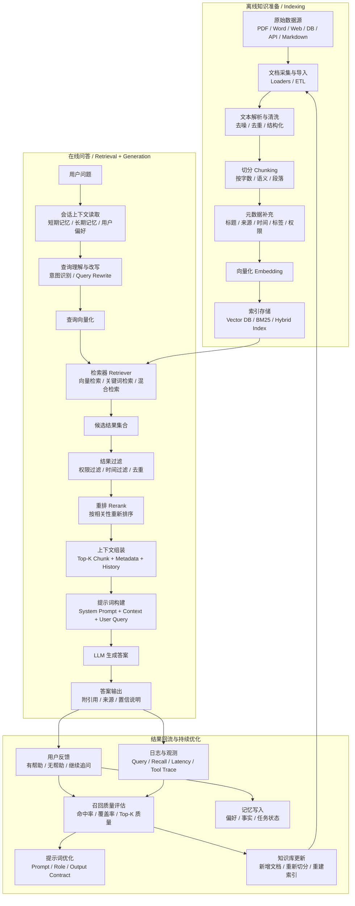

# RAG 完整流程图

下面这张图展示了一个相对完整的 RAG（Retrieval-Augmented Generation，检索增强生成）链路，包含离线索引构建、在线检索生成、结果回流优化三部分。

## 阅读顺序

1. 先看左边离线阶段：把原始知识处理成可检索的索引。
2. 再看中间在线阶段：用户问题进入后，先结合上下文，再去检索，再让 LLM 基于检索结果生成答案。
3. 最后看右边优化阶段：把用户反馈、日志、记忆写回系统，用于持续优化召回和回答质量。

## 关键模块解释

- `Loader / ETL`：负责把 PDF、网页、数据库、API 等外部内容接入系统。
- `Chunking`：把长文档拆成适合检索的小片段，避免上下文过长或召回粒度过粗。
- `Embedding`：把文本转成向量，供向量检索使用。
- `Retriever`：根据用户问题从索引里找出最相关的知识片段。
- `Rerank`：对初步召回结果再次排序，提升最终送给 LLM 的上下文质量。
- `Prompt Builder`：把系统角色、用户问题、历史对话、召回内容拼成最终提示词。
- `Memory`：既可以读取短期对话上下文，也可以读取长期用户偏好与事实。

## 在 Agent 系统里的典型位置

- `RAG` 负责“找知识”。
- `Tool Calling` 负责“调用外部能力”。
- `Memory` 负责“记住上下文和偏好”。
- `LLM / Agent` 负责“理解问题、决定流程、生成答案”。

如果把它们组合起来，一个完整 Agent 常见链路就是：

`用户问题 -> Agent 判断 -> 需要知识时走 RAG -> 需要能力时调 Tool -> 结合 Memory -> LLM 输出答案`
