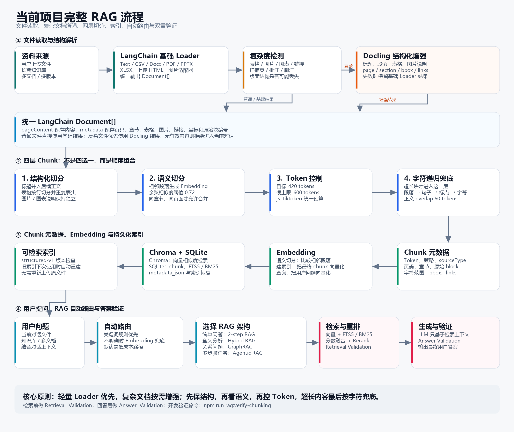

# RAG 知识点汇总



这份笔记是当前项目唯一的 RAG 学习文档。原来的 `rag-architecture-notes.md` 已合并到这里，避免同一套概念分散在多个文件里。

## 1. 先分清两个层级

RAG 系统里最容易混的是“怎么检索”和“从哪里检索”。

```text
architecture：这次 RAG 怎么执行
sourceScope：资料从哪里来
```

当前项目里的 architecture：

```text
2-step RAG
Agentic RAG
Hybrid RAG
GraphRAG
```

当前项目里的 sourceScope：

```text
uploaded-document：当前对话上传的文件
knowledge-base：长期知识库
multi-document：多文档 / 多版本资料
```

正确理解是：

```text
同一个知识库问题，可以走 Hybrid RAG，也可以走 GraphRAG。
同一个上传文件问题，可以走 2-step RAG，也可以走 Agentic RAG。
```

## 2. 2-step RAG

2-step RAG 是最简单、最低成本的固定流程：

```text
用户问题
  -> 检索一次相关文档片段
  -> 把片段放入 Prompt
  -> LLM 基于片段回答
```

适合：

```text
简单事实问答
解释某个概念
查找某个信息
用户没有要求全文分析或多步骤处理
```

当前项目对应：

```text
src/rag/vectorDocumentIndex.ts
searchVectorDocumentIndex()
```

默认策略：能用 2-step RAG 解决的问题，就不升级到更复杂、更耗 token 的链路。

## 3. Agentic RAG

Agentic RAG 的核心不是“检索更复杂”，而是：

```text
由 LLM Agent 决定是否调用检索工具、何时调用、调用几次。
```

流程：

```text
用户问题
  -> 进入 Agent
  -> Agent 判断是否需要工具
  -> Agent 调用文档检索工具或其他工具
  -> 工具返回资料
  -> Agent 继续推理
  -> 输出最终回答
```

适合：

```text
生成
改写
对比
继续处理
整理成表格
制定计划
多步骤任务
图片能力判断
```

当前项目对应：

```text
src/agents/langChainToolAgent.ts
src/tools/langchain/uploadedDocumentTool.ts
```

## 4. Hybrid RAG

Hybrid RAG 是增强版检索链路，重点是提高召回质量和答案可靠性。

当前项目里的 Hybrid RAG：

```text
用户问题
  -> 查询增强
  -> 生成 query embedding
  -> Chroma 向量检索
  -> SQLite FTS5 / BM25 关键词检索
  -> 分数融合
  -> Rerank 重排
  -> Retrieval Validation 检索质量验证
  -> LLM 生成回答
  -> Answer Validation 答案验证
```

适合：

```text
总结全文
分析整份资料
提取目录大纲
知识库问答
多文档 / 多版本资料检索
需要更稳召回的宽泛问题
```

当前项目对应：

```text
src/rag/vectorDocumentIndex.ts
searchHybridDocumentIndex()
```

## 5. GraphRAG

GraphRAG 是在文本片段检索之外，再加一层“实体关系图谱扩展”。

它关注的不是“哪个 chunk 最像用户问题”，而是：

```text
文档里有哪些关键概念？
这些概念出现在哪些 chunk？
哪些概念经常一起出现？
用户问某个概念时，是否应该带出相邻概念和相关 chunk？
```

当前项目里的 GraphRAG 是轻量学习版：

```text
1. 文档正常切 chunk
2. chunk 正常做 embedding / Chroma / SQLite FTS5
3. 从 chunk 文本里抽取实体词
4. 同一 chunk 中共同出现的实体形成关系边
5. 实体节点和关系边写入 SQLite
6. 用户问关系、依赖、影响、链路、因果时路由到 GraphRAG
7. GraphRAG 先复用 Hybrid RAG，再用图谱扩展相关 chunk
8. 最后仍由 LLM 基于检索上下文回答
```

当前支持的 GraphRAG Search Mode：

```text
Basic Search：保留 Hybrid RAG 基础结果
Local Search：围绕命中的实体做局部关系扩展
Global Search：从高频实体和文档不同位置看整体结构
DRIFT Search：先全局定位，再局部深入
Question Generation：根据实体关系生成可继续追问的问题
```

当前项目对应：

```text
src/rag/graphRag.ts
src/rag/ragArchitectureRouter.ts
src/rag/knowledgeBaseRetriever.ts
src/db/sqlite.ts
```

## 6. 自动选择规则

当前项目不是固定使用某一种 RAG，而是根据用户当前对话自动选择最合适的路径。

路由顺序：

```text
1. 如果是图片：走 Agentic，让模型能力判断是否支持视觉理解
2. 如果关键词明确：直接判断，不额外做 embedding 意图判断
3. 如果关键词不明确：用 embedding 做语义相似度兜底
4. 如果仍不明确：默认回到最低成本的 2-step RAG
```

自动选择表：

```text
简单问答 -> 2-step RAG
全文总结 / 整体分析 -> Hybrid RAG
关系 / 依赖 / 因果 / 链路 -> GraphRAG
生成 / 改写 / 对比 / 多步骤任务 -> Agentic RAG
知识库 / 多文档 -> 先确定 sourceScope，再按同一套规则选 architecture
```

这样做的目标：

```text
能用低成本路径解决的问题，不升级到高成本路径。
需要更强检索能力的问题，才使用 Hybrid 或 GraphRAG。
需要模型自己调工具的问题，才使用 Agentic。
```

当前项目对应：

```text
src/rag/ragArchitectureRouter.ts
selectDocumentRagArchitecture()
selectKnowledgeBaseRagArchitecture()
```

## 7. 文档解析与四层 Chunk

### 7.1 文件是怎么读取的

文件读取发生在切分之前。它的任务是把不同格式统一转换成 LangChain `Document[]`：

```text
PDF、Word、Excel、PPT、HTML、图片等原始文件
  -> 文件类型判断
  -> LangChain 基础 Loader
  -> 复杂度检测
  -> 必要时使用 Docling 增强
  -> 统一 LangChain Document[]
  -> 四层切分
```

为什么统一成 `Document[]`：

```text
pageContent：保存可检索内容
metadata：保存页码、章节、表格、图片、链接和坐标
```

后面的 Chunker、Embedding、Retriever 和向量数据库只依赖这两个字段，不需要继续判断原文件是 PDF 还是 Office。

#### 基础 Loader

当前项目优先使用 LangChain 标准 Loader：

```text
TXT / Markdown -> TextLoader
CSV -> CSVLoader
DOC / DOCX -> DocxLoader
PDF -> PDFLoader（按页读取）
PPTX -> PPTXLoader
网页 URL -> HTMLWebBaseLoader
```

LangChain 没有直接覆盖或不能完整处理的本地格式，会通过符合 `DocumentLoader` 接口的项目适配器读取：

```text
XLS / XLSX -> SpreadsheetDocumentLoader
用户上传的 HTML -> UploadedHtmlDocumentLoader
图片 -> ImageTextDocumentLoader
带图片的 PPTX 本地回退 -> EnhancedPptxDocumentLoader
```

“项目适配器”不代表脱离 LangChain。它们最终仍返回标准的 `Document[]`，后续处理链路完全相同。

#### 为什么还需要 Docling

基础 Loader 更轻、更快，适合普通文本文件；但复杂文件可能包含：

```text
多级标题和复杂排版
表格和合并单元格
图片、图表和流程图
批注、脚注和嵌入对象
超链接和外部引用
扫描页面及文字坐标
```

Docling 负责把这些复杂内容转换成结构化文档块，并尽量保留：

```text
blockType
sectionPath
pageNumber
bbox
tableCells / tableHtml
图片或图表说明
links
```

Docling 不是只处理 PDF。当前项目会对以下格式执行复杂度检测：

```text
PDF：扫描页、图片、表格、低文本页面
DOCX：表格、图片、图表、嵌入对象、批注、脚注、链接
XLSX：图片、图表、绘图、结构化表、批注、外部链接
PPTX：图片、图表、嵌入对象、表格、链接
HTML：表格、图片、图形、链接
```

旧版二进制 Office：

```text
DOC / XLS / PPT
```

会直接尝试交给 Docling。处理这些旧格式时，Docling 容器还需要 LibreOffice 支持。

#### 基础读取与复杂增强的顺序

现代办公文件使用安全回退链路：

```text
1. 先运行 LangChain 基础 Loader
2. 检测文件是否包含复杂结构
3. 普通文件直接使用基础结果
4. 复杂文件调用 Docling
5. Docling 成功：使用结构化结果
6. Docling 失败：保留基础 Loader 结果
7. 两种方式都没有可用内容：拒绝绑定到当前对话
```

这样设计可以避免：

```text
所有普通文件都调用重型解析服务
Docling/Docker 暂时不可用时整个上传功能失效
错误文件或空文件污染当前对话和 RAG 索引
```

Docling 请求不会写死为 `pdf`，而是根据上传文件名和内容自动识别 PDF、DOCX、XLSX、PPTX、HTML 等格式。

#### 图片内容的边界

```text
图片文字提取：读取图片中的文字
图片语义理解：理解人物、物体、图形关系或流程含义
```

这两个能力不同。基础图片 Loader 主要提取文字；复杂文档中的图片可由 Docling 生成图片说明。聊天中直接分析原始图片，还需要用户当前选择的模型支持视觉能力。

#### Docling 服务

Docling 和 Chroma 由 Docker Compose 管理：

```powershell
docker compose up -d
docker compose ps
```

默认地址：

```text
Docling：http://127.0.0.1:5001
Chroma：http://127.0.0.1:8000
```

相关代码：

```text
src/rag/langChainDocumentLoader.ts
src/rag/doclingDocumentLoader.ts
src/rag/officeTextExtractor.ts
src/rag/pptxTextExtractor.ts
src/rag/imageOcrExtractor.ts
```

### 7.2 为什么要切分

LLM 和 Embedding 模型都有上下文长度限制，不能把一整份长文档无限制地直接传入模型。

RAG 会先把文件解析成统一的 LangChain `Document[]`，再切成多个 chunk：

```text
原始文件
  -> LangChain 基础 Loader
  -> 复杂文件由 Docling 增强解析
  -> LangChain Document[]
  -> 四层切分
  -> chunk embedding
  -> Chroma / SQLite 索引
```

切分的目标不是简单追求“每块一样长”，而是同时满足：

```text
结构尽量完整
语义尽量连贯
不超过模型 Token 上限
检索结果能够定位回原文
```

### 7.3 四种切分不是四选一

当前项目按照固定顺序组合使用四种切分：

```text
结构化切分
  -> 语义切分
  -> Token 上限控制
  -> 超长块字符递归兜底
```

#### 结构化切分

结构化切分先利用 Docling/LangChain Loader 提供的文档结构：

```text
标题：暂存并合并到后续正文，避免形成只有标题的短 chunk
正文：按自然段落整理
表格：按行切分，每个表格 chunk 重复表头
图片/图表说明：保持独立，不和普通正文混合
章节：保留 sectionPath
位置：保留 pageNumber、bbox 和原始 block 编号
链接：保留 links 元数据
```

为什么表格要重复表头：

```text
如果检索只命中表格中间几行，而 chunk 没有表头，
模型就不知道每一列分别代表什么。
```

#### 语义切分

语义切分会把相邻正文段落转换成 Embedding，然后计算余弦相似度：

```text
相邻段落属于同一章节和页面
  + 相似度达到阈值
  + 合并后没有超过目标 Token 数
  -> 合并为一个语义 chunk
```

当前阈值：

```text
semanticSimilarityThreshold = 0.72
```

语义切分失败时不会导致文件上传失败。系统会关闭这一层，继续使用结构化、Token 和字符切分结果。

#### Token 切分

Token 是模型处理文本的基本计量单位，不等于字符数：

```text
英文单词可能由一个或多个 Token 组成
中文字符与 Token 也不是固定的一比一关系
```

当前项目使用 `js-tiktoken` 的 `cl100k_base` 计算稳定的 Token 预算：

```text
目标大小：420 tokens
硬上限：600 tokens
超长正文重叠：60 tokens
```

`cl100k_base` 是统一预算工具，和实际厂商模型的 Tokenizer 可能存在少量差异，因此硬上限需要保留安全余量。

#### 字符递归切分

字符切分是最后的安全兜底，而不是第一步：

```text
超长正文/单元格
  -> 先按段落
  -> 再按换行
  -> 再按中文句号、问号、感叹号、分号、逗号
  -> 再按空格
  -> 最后才按字符强制切开
```

虽然切分位置由字符分隔符决定，但块大小仍由 Token 数计算。

### 7.4 当前项目参数

参数统一位于：

```text
src/rag/documentChunkLab.ts
RAG_RETRIEVAL_CONFIG
```

当前值：

```text
targetChunkTokens = 420
maxChunkTokens = 600
chunkOverlapTokens = 60
semanticSimilarityThreshold = 0.72
semanticEmbeddingBatchSize = 32
```

核心实现：

```text
src/rag/structuredDocumentChunker.ts
splitDocumentsWithStructure()
```

### 7.5 Chunk 保存哪些信息

每个 chunk 不只保存文本，还保存：

```text
content：chunk 文本
tokenCount：Token 数量
splitStrategy：结构/语义/表格/字符兜底等切分策略
sourceType：text / table / image_ocr / image_summary
pageNumber：页码
sectionPath：章节路径
parentBlockIndexes：对应的原始文档 block
startChar / endChar：原文字符范围
boundingBox：版面坐标
links：块内链接
chunkingVersion：切分算法版本
```

这些元数据会写入 SQLite 的 `document_chunks.metadata_json`，常用检索字段也会同步写入 Chroma。

### 7.6 为什么需要切分版本

当前切分版本：

```text
structured-v1
```

项目升级切分算法后，数据库里可能还保存着旧 chunk。

系统读取索引时会比较 `chunkingVersion`：

```text
版本相同 -> 直接恢复索引
版本不同或缺失 -> 自动重新切分、Embedding 并覆盖旧索引
```

因此已经上传的文件不需要重新上传，下次使用该文档时会自动升级索引。

### 7.7 验证切分

执行：

```powershell
npm run rag:verify-chunking
```

校验内容：

```text
标题是否并入正文
长表格是否按行拆分
每个表格 chunk 是否重复表头
图片说明是否保持独立
是否存在超过 Token 硬上限的 chunk
语义合并是否正常执行
```

校验脚本固定使用本地 hash embedding，不会调用 SiliconFlow，也不会消耗 API Token。

## 8. Embedding

Embedding 是把文本变成数字向量：

```text
文本 -> number[]
```

它不是“给 AI 看”，而是让计算机可以比较语义相似度。

例子：

```text
“RAG 是检索增强生成”
“先查资料再让模型回答”
```

这两句话字面不同，但语义接近。Embedding 会让它们在向量空间里距离更近。

当前项目里 Embedding 用在三个地方：

```text
1. 文档检索：比较用户问题和文档 chunk 是否相似
2. 路由兜底：关键词不明确时，判断问题更像哪种 RAG 意图
3. 语义切分：判断相邻正文段落是否属于同一语义主题
```

当前项目对应：

```text
src/rag/embeddingProvider.ts
```

配置示例：

```env
EMBEDDING_PROVIDER=siliconflow
EMBEDDING_MODEL=BAAI/bge-m3
```

## 9. GraphRAG 实体抽取

GraphRAG 需要先知道文档里的“实体 / 概念”是什么。

当前项目默认：

```env
GRAPH_RAG_ENTITY_EXTRACTOR=hybrid
```

含义：

```text
先使用本地规则抽取实体
如果规则结果已经足够，就不调用模型
如果规则结果太少或质量不足，再调用模型补全
这样既保留低成本，又能在必要时提高图谱质量
```

可选模式：

```text
hybrid：默认推荐，规则优先，必要时模型补全
rule：只用本地规则，不额外消耗模型 token
llm：只用模型抽取，质量更高但成本也更高
```

模型补全配置：

```env
GRAPH_RAG_EXTRACTOR_PROVIDER=deepseek
GRAPH_RAG_EXTRACTOR_MODEL=deepseek-v4-flash
```

注意：`hybrid` 不是每个 chunk 都调用模型。它会先跑算法，只有算法结果不足时才调用模型。

## 10. Chroma

Chroma 是向量数据库。

当前项目用它保存和检索 chunk embedding：

```text
data/chroma/
```

启动：

```powershell
npm run chroma
```

相关代码：

```text
src/rag/chromaVectorStore.ts
src/rag/vectorStoreProvider.ts
```

## 11. SQLite / FTS5 / BM25

SQLite 负责保存：

```text
对话记录
上传文件元数据
知识库文件元数据
chunk fallback
chunk 结构、Token、定位和切分版本元数据
FTS5 / BM25 关键词检索索引
GraphRAG 节点和边
LangGraph checkpoint
长期用户偏好
```

FTS5 是 SQLite 的全文检索能力。

BM25 是关键词相关性排序算法。

它们负责补足向量检索的不足：

```text
向量检索擅长语义相似
BM25 擅长精确关键词命中
```

## 12. Rerank

Rerank 是重排。

当前项目不是模型 reranker，而是规则重排：

```text
hybridScore
关键词覆盖率
BM25 分数
标题加权
位置加权
长度惩罚
```

相关代码：

```text
src/rag/vectorDocumentIndex.ts
rerankChunks()
```

## 13. Retrieval Validation

Retrieval Validation 是检索质量验证。

它发生在模型回答之前，检查“检索出来的 chunk 是否足够支撑这次回答”。

当前项目会根据这些信号判断：

```text
是否是全文分析请求
bestHybridScore 是否达到最低可用分数
matchedTermCount 是否覆盖了足够多的查询关键词
```

作用：

```text
避免把弱相关 chunk 直接塞给模型
发现检索结果可能不够时，给后续回答更谨慎的信号
为 Answer Validation 提供前置判断
```

相关代码：

```text
src/rag/vectorDocumentIndex.ts
searchHybridDocumentIndex()
validation.isLikelySufficient
```

注意：Retrieval Validation 和 Answer Validation 不是一回事。

```text
Retrieval Validation：回答前，验证检索结果够不够好。
Answer Validation：回答后，验证模型答案是否被上下文支持。
```

## 14. Answer Validation

Answer Validation 是答案验证。

作用：

```text
检查回答是否被检索上下文支持
避免模型把没检索到的内容说得太肯定
必要时让回答变得更谨慎
```

相关代码：

```text
src/server.ts
validateDocumentAnswer()
```

## 15. 文件存储

用户上传文件：

```text
data/uploads/{userId}/{threadId}/
```

长期知识库文件：

```text
data/knowledge-bases/{knowledgeBaseId}/
```

数据库只保存相对路径 `storageKey`，不保存绝对路径，也不保存 `127.0.0.1` 这类 URL。

## 16. 常用命令

启动 Chroma：

```powershell
npm run chroma
```

构建知识库索引：

```powershell
npm run kb:index
```

验证四层切分：

```powershell
npm run rag:verify-chunking
```

启动项目：

```powershell
npm start
```

类型检查：

```powershell
npx.cmd tsc --noEmit
```

## 17. 一句话记忆

```text
2-step RAG：固定检索一次，再回答。
Agentic RAG：Agent 决定是否调用检索工具。
Hybrid RAG：检索链路加入增强、融合、重排、Retrieval Validation。
GraphRAG：在文本检索之外加入实体关系图谱扩展。
四层 Chunk：先保结构，再看语义，再控 Token，超长内容最后按字符递归切分。
Answer Validation：模型回答后检查答案是否被检索上下文支持。
sourceScope：只表示资料从哪里来，不是 RAG 架构。
```
