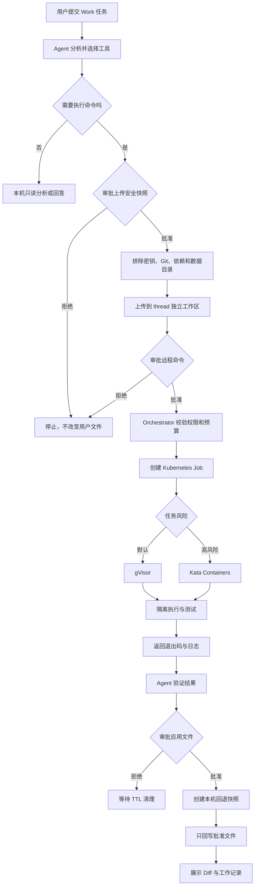

# 远程 Sandbox 与生产执行隔离

## 一、正式架构

```text
Electron 客户端（选择目录、审批、Diff、回退）
  -> Agent API（模型、LangGraph、记忆、权限）
  -> Deep Agents BaseSandbox 协议
  -> 自建 Sandbox Orchestrator
  -> Kubernetes Job
  -> gVisor（默认）或 Kata Containers（高风险）
```

LangSmith 已从项目中移除，不需要 `LANGSMITH_API_KEY`，也不依赖第三方托管 Sandbox。“开源免费”表示没有托管平台的软件使用费，不表示服务器 CPU、内存、存储和网络没有成本。

## 二、各层职责

### Deep Agents Sandboxes

`BaseSandbox` 是 Agent 与执行环境之间的统一协议：

- `execute` 执行命令；
- `uploadFiles` 传入批准后的安全文件；
- `downloadFiles` 取回指定结果文件；
- Agent 不需要知道底层运行时。

### Sandbox Orchestrator

代码位于 `src/sandbox-orchestrator/server.ts`，负责：

- 校验内部服务 Token；
- 校验 Sandbox ID、路径、镜像和 RuntimeClass；
- 管理每个 Work thread 的隔离文件目录；
- 为每次命令创建一次 Kubernetes Job；
- 等待 Job 并返回截断日志；
- 按 TTL 清理过期 Job 和文件；
- 删除对话时销毁对应执行数据。

Orchestrator 不接收模型 API Key、用户登录 Token 或完整对话历史。

### Kubernetes Jobs

- `backoffLimit: 0`：不可信命令不自动重试；
- `activeDeadlineSeconds`：限制执行时间；
- `ttlSecondsAfterFinished`：清理 Job 对象；
- `resources`：限制 CPU、内存和临时磁盘；
- 同一 thread 挂载同一工作目录，不同 thread 使用不同子目录。

### Docker / OCI 安全

镜像由服务端允许列表控制。Job 使用非 root、禁止提权、删除全部 capabilities、`RuntimeDefault` seccomp、只读根文件系统、限额 `/tmp`，并禁止挂载 ServiceAccount Token、宿主机目录和 Docker Socket。

生产集群还应在 kubelet 配置 `podPidsLimit` 防止 fork bomb；PID 限制不是标准 Pod `resources` 字段。

### gVisor / Kata Containers

二者属于同一隔离层，不同时用于一个 Job：

- gVisor `runsc`：默认，启动较快，适合常规代码和测试；
- Kata Containers：轻量虚拟机边界，适合更高风险任务，开销更大。

YAML 中声明 RuntimeClass 不代表节点已安装运行时，集群管理员仍需安装对应 handler。

## 三、执行流程



## 四、Chat 与 Work 边界

- Chat 模式不注入 Sandbox 工具。
- Work 模式才可使用远程 Sandbox。
- Work 对话和记忆仍在用户电脑本地；远程只保存临时副本。
- 启用远程模式后，本机写入和本机命令工具从 Agent 工具集移除。
- 唯一回写通道是 `apply_sandbox_files`，必须审批并创建快照。

## 五、网络和供应链

Sandbox Job 默认由 `NetworkPolicy` 禁止全部入站和出站。需要下载依赖时应通过独立 egress proxy 按域名、协议、流量和时间授权，而不是直接开放公网。

生产镜像应固定 digest、执行漏洞扫描和签名、从私有 Registry 提供，并由准入策略拒绝未签名镜像。

## 六、部署文件

- `deploy/sandbox-orchestrator.Dockerfile`：Orchestrator 镜像；
- `deploy/kubernetes/sandbox-platform.yaml`：Namespace、RBAC、PVC、Deployment、Service、NetworkPolicy、ResourceQuota 和 RuntimeClass；
- `sandbox-platform.yaml` 只引用名为 `sandbox-service-token` 的 Secret，不在仓库保存 Token 文件；部署系统负责创建并注入真实密钥。

`deploy` 不是另一套 Docker 环境或数据目录。根目录的 `compose.yaml` 用于本地启动 Redis、Chroma 和 Docling；`deploy/sandbox-orchestrator.Dockerfile` 只负责把 Orchestrator 构建成生产镜像，`deploy/kubernetes` 则描述该镜像如何在生产集群运行。它们共用标准 OCI/Docker 镜像体系，但职责和生命周期不同。

部署前必须调整镜像地址、RWX StorageClass、gVisor/Kata handler、资源配额和镜像允许列表。服务 Token 必须通过环境变量或 Secret 管理系统创建，不能提交到 Git。

## 七、应用配置

### 本地一键测试

开发时只需启动 Docker Desktop，然后执行：

```powershell
npm run desktop
```

Electron 会自动启动独立 Sandbox Orchestrator，生成本机内部 Token，并通过 Docker Engine 为每次命令创建受限容器。命令不会在 Agent/Express 进程中直接执行。容器使用断网、非 root、只读根文件系统、能力删除、PID/CPU/内存限制，任务结束后自动销毁。

Token 读取顺序如下：

1. 优先读取 `SANDBOX_SERVICE_TOKEN` 环境变量，适合开发环境和自动化部署；
2. 未配置时由 Electron 生成，并通过 `safeStorage` 使用 Windows DPAPI、macOS Keychain 或 Linux 系统密钥服务加密保存；
3. 系统密钥服务不可用时只在当前进程内使用，不允许降级为明文文件；
4. 旧版 `sandbox-service.token` 明文文件会在首次启动时迁移并删除。

`.env` 也是明文文件，只适合本地开发且必须被 Git 忽略；生产环境应使用 Kubernetes Secret 或部署平台的 Secret 管理能力。

本地 Docker backend 用于开发和集成测试；正式多租户部署仍使用 Kubernetes + gVisor/Kata。

### 正式部署

```env
SANDBOX_PROVIDER=orchestrator
SANDBOX_ORCHESTRATOR_URL=http://sandbox-orchestrator.kimibai-sandbox.svc.cluster.local:3010
SANDBOX_SERVICE_TOKEN=至少32字符的随机内部令牌
SANDBOX_RUNTIME_CLASS=gvisor
SANDBOX_DEFAULT_IMAGE=node:22-bookworm-slim
SANDBOX_IDLE_TTL_SECONDS=600
SANDBOX_COMMAND_TIMEOUT_SECONDS=900
SANDBOX_MAX_TRANSFER_BYTES=20971520
```

内部 Token 只存在于 Agent 后端和 Kubernetes Secret，不能写入 Electron 安装包。

## 八、上线检查

- 验证 gVisor/Kata 的安装和兼容性；
- 验证 NetworkPolicy 在实际 CNI 中生效；
- 验证超时、OOM、磁盘超限和取消；
- 验证拒绝审批后没有文件回写；
- 验证不同 thread 不能读取彼此目录；
- 验证 Token 轮换、TTL 和孤儿 Job 清理；
- 增加审计日志、指标、告警、并发限流和渗透测试。
