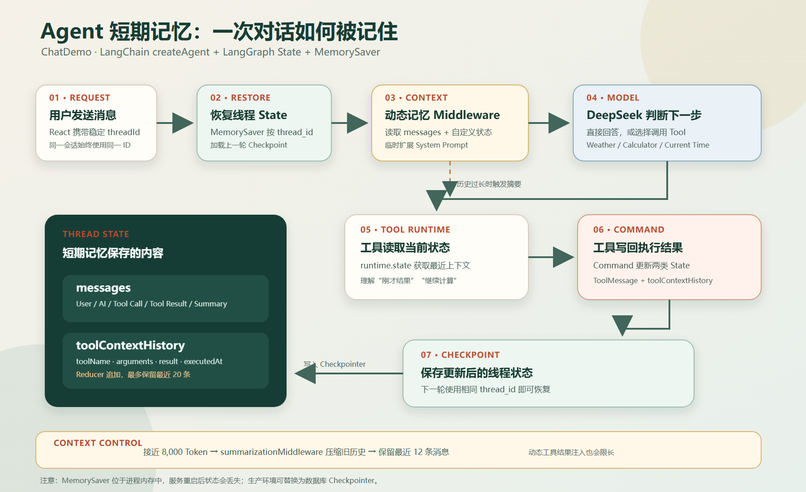

# LangChain Agent 短期记忆



## 一句话理解

短期记忆是 Agent 在同一个对话线程中保存和恢复的状态。它不仅包括用户与 AI 的消息，还可以包含工具调用结果等自定义字段，让 Agent 能理解“刚才的结果”“继续计算”等上下文。

当前项目使用 LangGraph 的 `MemorySaver` 作为内存型 Checkpointer，通过稳定的 `thread_id` 区分不同对话。

## 当前项目保存了什么

### 1. 对话消息 `messages`

`messages` 是 LangChain Agent 的内置状态，其中包含：

- 用户消息 `HumanMessage`
- 模型回复 `AIMessage`
- 模型生成的 Tool Call
- 工具返回的 `ToolMessage`
- 历史过长后生成的摘要

### 2. 工具上下文 `toolContextHistory`

项目通过 `ToolMemoryState` 增加了结构化工具历史。每条记录包含：

```ts
{
  toolName: string;
  arguments: unknown;
  result: unknown;
  executedAt: string;
}
```

它比只保存自然语言消息更稳定，代码可以直接读取最近调用的工具、参数、结果和时间。

当前只保留最近 20 条结构化工具记录，避免状态无限增长。

## 一次请求如何使用短期记忆

1. React 前端从 `sessionStorage` 读取稳定的 `threadId`。
2. 服务端把用户消息和 `threadId` 传给 `LangChainProvider`。
3. Agent 使用 `configurable.thread_id` 请求 LangGraph。
4. `MemorySaver` 根据 `thread_id` 恢复该线程之前保存的 State。
5. `dynamicMemoryPromptMiddleware` 在调用模型前读取 `messages` 和 `toolContextHistory`。
6. Middleware 根据状态创建动态 System Prompt，但不把它写入消息历史。
7. 模型决定直接回答，或者调用 Weather、Calculator、Current Time 工具。
8. 工具通过 `ToolRuntime.state` 读取最近的工具上下文。
9. 工具执行完成后返回 `Command`，同时写入 `ToolMessage` 和 `toolContextHistory`。
10. Agent 完成后，Checkpointer 保存更新后的 State，供下一轮恢复。

## 工具如何读取和写入状态

### 从工具中读取

工具接收 `ToolMemoryRuntime`，可以访问当前线程状态：

```ts
const previous = readLastToolContext(runtime);
```

因此 Calculator 可以知道上一轮计算结果，其他工具也可以访问最近一次工具调用的上下文。

### 从工具中写入

工具不能直接修改 State，而是返回 LangGraph `Command`：

```ts
return new Command({
  update: {
    toolContextHistory: currentToolContext,
    messages: [toolMessage]
  }
});
```

`ToolMemoryState` 为 `toolContextHistory` 配置了 Reducer。多个工具并行完成时，Reducer 会把更新安全地追加到数组，而不是互相覆盖。

## Middleware 如何创建动态提示

`dynamicMemoryPromptMiddleware` 使用 `createMiddleware` 和 `wrapModelCall`：

```ts
wrapModelCall: async (request, handler) => {
  const { messages, toolContextHistory } = request.state;
  const dynamicPrompt = buildPrompt(messages, toolContextHistory);

  return handler({
    ...request,
    systemMessage: request.systemMessage.concat(dynamicPrompt)
  });
}
```

动态提示包含当前消息数量，以及最近工具的名称、参数、结果和执行时间。

这种方式只修改当前模型请求，不会把动态 System Prompt 保存进 `messages`，因此不会在每一轮重复累积。

## 对话过长时如何处理

当前项目使用 `summarizationMiddleware`：

用户也可以在输入框左侧点击 `+` -> `清除上下文`。该操作会清除当前 `threadId` 的消息、LangGraph Checkpoint、工具状态、任务计划和附件检索索引，但保留对话本身、长期用户偏好、工作目录、工作修改记录、生成文件以及该对话安装的 Skill/MCP。

- 默认按 64,000 Token 上下文窗口计算，模型不同时可通过环境变量调整。
- 达到窗口的 50% 时，先将较早的工具大输出替换为占位说明，保留最近 6 个工具结果和原始工具参数。
- 达到窗口的 72%，或者消息达到 100 条时，自动把旧消息压缩成结构化摘要。
- 摘要后保留最近 16 条完整消息，并保持 AI Tool Call 与 Tool Result 配对完整。
- 摘要必须保留当前目标、用户约束和纠正、已确认决策、文件修改、命令结果、待审批操作、未完成事项和关键错误。
- 重复内容、寒暄、过期计划、冗长日志、重复工具输出和私有推理不会进入摘要。
- 结构化工具历史继续由 `toolContextHistory` 独立维护。
- 工具历史最多保留最近 20 条。
- 注入动态提示时，参数最多保留 600 个字符，结果最多保留 1,200 个字符。

摘要不是“删除所有记忆”，而是把较早的详细对话压缩成更短的语义记录，同时保留近期消息与结构化状态。

## 生命周期与隔离

### 同一线程

只要使用同一个 `thread_id`，下一轮就能恢复上一轮状态。

### 不同线程

不同 `thread_id` 的状态相互隔离，不会串话。

### 切换模型或角色

Provider 使用“模型 + System Prompt + threadId”区分 Agent 使用场景，避免 Few-shot 初始化和角色上下文混淆。

### 服务重启

当前使用 SQLite Checkpointer，不是 `MemorySaver`。Chat 状态保存在 `data/chat-demo.sqlite`，Work 状态保存在系统文档目录下的 `KimiBai/data/work.sqlite`，因此服务和电脑重启后仍能恢复。

## 当前代码对应关系

| 文件 | 职责 |
| --- | --- |
| `client/main.tsx` | 创建并保存前端 `threadId` |
| `src/server.ts` | 接收并转发 `threadId` |
| `src/providers/langChainProvider.ts` | 复用 Agent，管理线程初始化 |
| `src/agents/langChainToolAgent.ts` | 注册 State、Checkpointer、Middleware 和 Tools |
| `src/agents/contextCompactionPolicy.ts` | 定义自动压缩水位、保留预算和结构化摘要规则 |
| `src/agents/toolMemoryState.ts` | 定义自定义状态、Reducer、工具读写函数 |
| `src/agents/dynamicMemoryPromptMiddleware.ts` | 读取完整状态并创建动态 System Prompt |
| `src/tools/langchain/*.ts` | 使用 `ToolRuntime` 读取状态并用 `Command` 写回 |

## Memory、State 与 Runtime 的区别

| 概念 | 含义 |
| --- | --- |
| Memory | Agent 记忆能力的总称 |
| State | 当前线程实际保存的数据，如 `messages` 和 `toolContextHistory` |
| Checkpointer | 按 `thread_id` 保存和恢复 State |
| `ToolRuntime` | 工具执行时访问 State、Tool Call 等运行信息的入口 |
| Middleware | 模型调用前后读取状态并调整上下文或行为 |

`ToolRuntime` 不是 State 本身。它是工具访问当前 State 的运行时入口；真正被 Checkpointer 保存的是 State。

## 核心原则

1. 使用稳定且唯一的 `thread_id`。
2. 自定义状态应使用 Schema 明确定义。
3. 并行写入的数组状态应配置 Reducer。
4. 工具通过 `Command` 更新状态，不直接修改对象。
5. 动态提示只在模型调用时注入，不污染持久化消息。
6. 对话过长时使用摘要、裁剪和结构化状态共同控制上下文。
7. 实时数据不能只依赖历史快照，必须重新调用对应工具。
