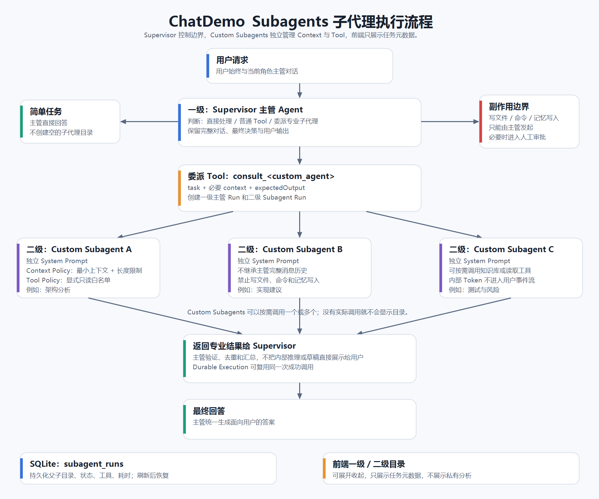

# Subagents 子代理学习笔记



## 1. Subagent 是什么

Subagent 是由主管 Agent 按需调用的专职 Agent。它拥有独立的 System Prompt、上下文窗口和工具权限，只负责一个明确的专业任务，然后把结果返回主管。

```text
用户只与主管 Agent 对话
        ↓
主管判断是否需要专业协作
        ├─ 简单任务：主管直接处理
        └─ 复杂任务：委派一个或多个 Subagent
                           ↓
                      返回专业结果
                           ↓
                   主管汇总并回答用户
```

Subagent 的结果是主管的内部工作资料，不是最终回答。前端只展示“正在并行处理 3 个内部任务”一类聚合状态，不能展示隐藏 Prompt、内部推理、子代理目录或未经主管验证的草稿。

## 2. 使用边界

适合使用 Subagent：

- 一个任务需要不同专业视角，例如架构、实现和测试。
- 主 Agent 的工具过多，需要把工具按领域隔离。
- 子任务需要独立上下文，避免污染主管对话。
- 多个专业分析彼此独立，可以并行完成。
- 不同团队需要独立维护自己的 Prompt 和工具。

不适合使用 Subagent：

- 简单问答、翻译或一次工具调用。
- 只是把一个很小的问题人为拆成多层。
- 子任务高度依赖完整对话，复制上下文的成本比直接处理更高。
- 只是为了让系统看起来更“智能”。

判断原则：

> 子代理带来的专业性、上下文隔离或并行收益，必须大于额外模型调用、Token 和调度成本。

## 3. Custom Subagents

当前项目的用户可见开发角色统一为“软件工程师”。具体技术方向由主管在运行时选择 Custom Subagents：

```text
软件工程师主管
├─ 软件架构子代理
├─ Python 工程子代理
├─ 前端工程子代理
├─ 后端与数据子代理
└─ 测试与质量子代理
```

每个 Custom Subagent 由以下配置组成：

| 配置 | 作用 |
| --- | --- |
| `id` | 稳定标识，用于 Tool 名称和运行记录 |
| `label` | 前端展示名称 |
| `description` | 告诉主管何时应该调用 |
| `systemPrompt` | 子代理的专业身份和输出要求 |
| `contextPolicy` | 控制接收哪些上下文以及最大长度 |
| `toolPolicy` | 显式声明允许调用的 Tool |
| `skillPolicy` | 声明允许按需委派的 Skill |
| `executionPolicy` | 声明审批后可用的写文件和命令工具 |

角色定义位于 `src/workflows-agents/`，公共运行层位于 `src/agents/roleSubAgentTools.ts`。新增角色子代理时修改定义，不需要复制整套 Agent 运行代码。

## 4. Context Management

子代理不应该继承主管的完整对话历史。当前项目只传入：

```text
主管角色（可配置）
委派任务（必须）
完成任务必需的上下文（可选）
期望产出（可配置）
```

`contextPolicy.maxContextChars` 会截断过长上下文，避免主管误把整个对话、整份文档或无关工具历史复制进去。

正确做法：

- 传递事实、约束、接口和需要分析的片段。
- 用 RAG 或只读 Tool 按需获取资料。
- 让主管保留完整用户对话和最终决策。
- 子代理返回结论、风险和建议，不返回冗长思考过程。

错误做法：

- 把所有消息原样传入每个子代理。
- 把长期记忆、上传文档全文和工具历史全部塞入 Prompt。
- 让不同子代理共享可无限增长的消息列表。

## 5. Tool 权限

Subagent 使用显式白名单，而不是继承主管全部工具。

当前默认只读工具：

- `calculator`
- `current_time`
- `get_weather`
- `retrieve_knowledge_base`
- `retrieve_uploaded_document_chunks`
- `recall_preference`
- `list_workspace_files`
- `read_workspace_file`

顾问型 Subagent 无论角色配置如何，都不能使用以下副作用工具：

- `write_workspace_file`
- `replace_workspace_text`
- `run_workspace_command`
- `remember_preference`

执行型 Subagent 可以真正完成编码工作，但必须同时满足：

- 只能用于绑定本地工作区的 Work 任务。
- 整批执行前经过 Human-in-the-loop 审批。
- 每个子任务声明最小 `allowedPaths`。
- 两个并行任务的写入范围不能重叠。
- 仍然禁止写长期记忆、修改上传原件或访问工作区之外。

因此不是“只有主管可以写代码”，而是主管负责授权和验收，执行型子代理在批准边界内干活。

## 6. Supervisor 与 Tool Calling

每个 Subagent 被包装成主管可以调用的内部 Tool：

```text
consult_software_architect
consult_python_engineer
consult_frontend_engineer
execute_backend_engineer
execute_quality_engineer
```

主管根据 Tool 的名称、描述和 Schema 决定是否调用。Schema 只允许传入：

- `task`：清晰、独立的专业任务。
- `context`：完成任务必需的最小背景。
- `expectedOutput`：主管需要的结果形式。

顾问型子代理只能调用白名单中的只读 Tool；执行型子代理在审批后才能调用获准的工作区工具。两者都不能继续创建下一级子代理，避免递归委派、越权和 Token 失控。

固定工具适合明确委派一个专家。动态批量调度使用：

| Tool | 用途 | 是否审批 |
| --- | --- | --- |
| `dispatch_dynamic_subagents` | 并行研究、分析、审核等只读任务 | 否 |
| `execute_dynamic_subagents` | 并行编码、修改和验证任务 | 是 |

## 7. Parallel Subagents 并行调度

并行不是“同时启动越多 Agent 越好”。只有互不依赖的子任务才能进入同一批次：

```text
主 Agent 分析目标
        ↓
拆分子任务并判断依赖
        ↓
构建任务 DAG
        ├─ 无依赖：进入同一并行 Wave
        └─ 有依赖：等待上游结果后再执行
        ↓
并发执行 → 结构化回传 → 主管验证与汇总
```

适合并行的例子：

- 一个子代理检查后端接口，另一个检查前端交互。
- 同时研究不同技术方案，再由主管比较。
- 实现完成后并行做安全审核和测试设计。
- 修改互不重叠的文件或目录。

必须串行的例子：

- 后一个任务需要前一个任务生成的接口或文件。
- 多个任务可能修改同一个文件、父目录或重叠路径。
- 一个任务需要依据另一个任务的验证结论决定方案。
- 审批、长期记忆写入等必须保持确定顺序的副作用。

当前调度限制：

| 限制 | 当前值 | 原因 |
| --- | --- | --- |
| 单批最大任务数 | 6 | 防止模型过度拆分和 Token 浪费 |
| 默认并发数 | 3 | 平衡速度、API 限流和本机资源 |
| 最大并发数 | 4 | 避免并发失控 |
| 默认单项超时 | 90 秒 | 防止子任务永久占用主任务 |
| 最大单项超时 | 180 秒 | 为复杂但合理的任务保留空间 |
| 批次上下文 | 12,000 字符 | 防止复制完整对话到每个子代理 |
| 默认结果预算 | 12,000 字符 | 给主管保留最终回答空间 |
| 最大结果预算 | 20,000 字符 | 限制多个结果挤占上下文 |

这些限制是 Harness 的硬边界，模型只能在范围内选择较小值，不能自行扩大。

## 8. Dynamic Subagents

Dynamic Subagents 表示子代理计划在运行时产生，而不是开发时写死执行顺序。

主管根据以下信息选择专家和任务数量：

- 用户目标和当前角色。
- 项目技术栈与文件范围。
- 当前 Thread 激活的 Skill 和 MCP。
- 子任务依赖、写入冲突和风险。
- 剩余时间、上下文和结果预算。

“动态”不代表模型可以任意创造无限角色。`specialistId` 必须来自当前角色 `subAgents` 白名单；未注册的专家会被调度器拒绝。这样兼顾灵活性和权限边界。

## 9. Async Subagents

Async Subagents 表示同一批独立子任务使用异步 worker pool 执行。主管不逐个串行等待模型调用，而是等待整批结构化结果到齐后继续汇总。

```text
execute_dynamic_subagents
        ├─ Worker 1：任务 A
        ├─ Worker 2：任务 B
        └─ Worker 3：任务 C
                  ↓
        Promise 并发收集结果
                  ↓
       主 Agent 统一验证和回答
```

当前实现不是脱离主任务无限运行的后台服务：子代理仍属于当前 Turn。用户停止主任务时，`AbortSignal` 会传播给所有运行项，防止产生孤儿任务。

每个结果使用统一结构：

```json
{
  "id": "review-api",
  "specialistId": "backend_engineer",
  "status": "succeeded",
  "output": "给主管的结论"
}
```

失败项使用 `failed`、`timed_out` 或 `cancelled`，并返回简短错误；一个 worker 失败不会丢弃其他成功结果。

## 10. 失败隔离、停止与结果汇总

- **失败隔离**：每个 worker 自己捕获错误并形成结构化结果。
- **超时隔离**：单项超时只终止该项，不自动取消同批兄弟任务。
- **停止传播**：用户停止主任务时取消整批未完成任务。
- **结果截断**：每个结果按批次预算分配上限，避免一个子代理占满上下文。
- **冲突隔离**：执行批次提前检查 `allowedPaths`，重叠时整批拒绝并行。
- **最终验证**：子代理结果不能直接回复用户，主管必须去重、解决冲突并形成最终答案。

## 11. 前端展示

Subagent 不创建独立 Thread，因此不会出现在左侧聊天、任务或项目列表中。主对话只显示聚合状态：

```text
正在并行处理 3 个内部任务 · 2 项进行中
内部任务已完成 2/3 · 1 项未完成
```

前端不展示子代理名称、工具清单、委派 Prompt、内部讨论和原始输出。这些信息只用于后端调度、恢复和诊断。

## 12. 持久化、耐久执行与隐私

`subagent_runs` 表保存任务树元数据：

- 父子 Run ID。
- Thread、Turn 和角色。
- Agent 名称与任务摘要。
- 工具白名单。
- 运行状态、开始时间、完成时间和错误。

它不保存并展示子代理的私有分析内容。刷新页面后，前端通过 `/api/subagents/runs` 恢复聚合状态，而不是恢复子代理目录。

固定 `consult_* / execute_*` 子代理调用经过 `executeDurableTask`：

- 同一工具调用恢复时复用成功结果。
- 避免因重试重复消耗模型 Token。
- 并发重复调用只能有一个领取执行权。

动态批次目前把每个 worker 的运行元数据写入 `subagent_runs`，支持刷新后恢复聚合状态；但它不会在应用重启后自动接着执行尚未完成的远程模型请求。重启恢复和结果复用属于下一层 Durable Scheduler 能力，不能把“已记录运行状态”误认为“后台模型调用必然续跑”。

## 13. Subagents 与其他概念的区别

| 概念 | 核心作用 |
| --- | --- |
| 普通 Tool | 执行确定性能力，例如计算、检索或文件操作 |
| Subagent | 使用独立 Prompt 和上下文完成专业推理 |
| `parallel_read` | 单 Agent 的只读任务并行，不是 Multi-Agent |
| Parallel Subagents | 多个独立 Agent 使用各自 Prompt 和上下文并行工作 |
| Dynamic Subagents | 主管在运行时决定创建哪些专职执行单元 |
| Async Subagents | 子任务通过受控异步 worker pool 并发执行 |
| Workflow | 用固定或条件 Edge 控制流程 |
| Handoff | 把对话控制权交给另一个 Agent |
| Supervisor | 用户仍面对主管，子代理只在内部协作 |

当前项目使用 Supervisor 模式，不使用 Handoff。最终用户始终与所选角色主管对话。

## 14. 当前项目文件映射

| 文件 | 职责 |
| --- | --- |
| `src/workflows-agents/types.ts` | Custom Subagent、Context 和 Tool Policy 类型 |
| `src/workflows-agents/*.ts` | 各角色的专职子代理定义 |
| `src/agents/roleSubAgentTools.ts` | 创建子代理、限制上下文、过滤工具、调用模型 |
| `src/agents/dynamicSubAgentDispatcher.ts` | 动态任务、并发池、预算、超时、取消与失败隔离 |
| `src/agents/subAgentRunRepository.ts` | 持久化主管与内部运行状态 |
| `src/agents/durableTaskExecution.ts` | 固定子代理调用的幂等与成功结果复用 |
| `src/agents/langChainToolAgent.ts` | 主管 Agent、事件过滤与进度状态 |
| `client/main.tsx` | 主对话内的聚合进度展示 |
| `public/styles.css` | 聚合状态视觉样式 |
