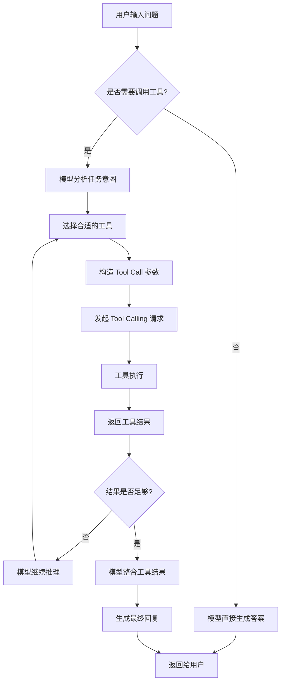

# Tool Calling 流程图

```mermaid
flowchart TD
    A[用户输入问题] --> B{是否需要调用工具?}

    B -- 否 --> C[模型直接生成答案]
    C --> Z[返回给用户]

    B -- 是 --> D[模型分析任务意图]
    D --> E[选择合适的工具]

    E --> F[构造 Tool Call 参数]
    F --> G[发起 Tool Calling 请求]

    G --> H[工具执行]
    H --> I[返回工具结果]

    I --> J{结果是否足够?}
    J -- 否 --> K[模型继续推理]
    K --> E

    J -- 是 --> L[模型整合工具结果]
    L --> M[生成最终回复]
    M --> Z[返回给用户]
```
